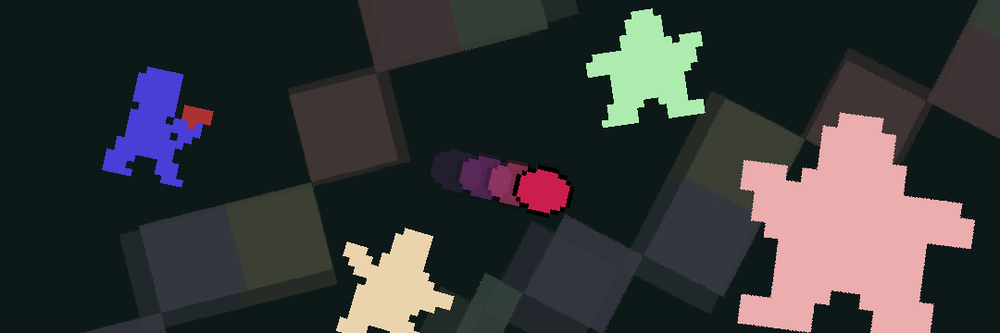
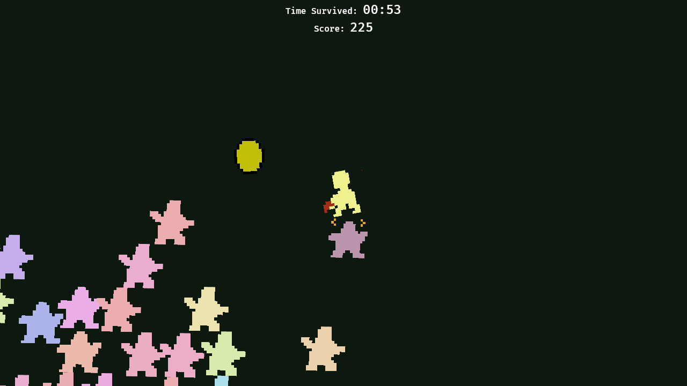
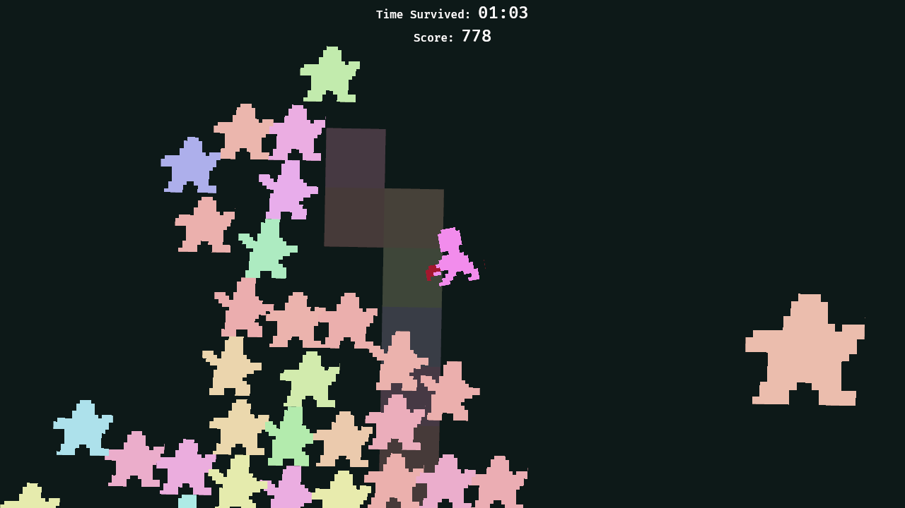
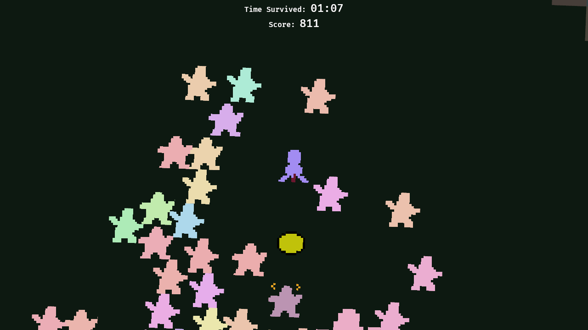

# Having Fun Yet?
A game made in 72 hours for [__Ludum Dare 58__][ld]!  
> Theme: __Collector__

__Check it out on [itch.io][itch]!__

> What is happening to me?

You took a funny looking pill and now there are creatures chasing you.  
Luckily you have your little red cannon on you. It's bullet is designed to be re-usable, which is good because you only have one shot. Try not to lose it.  

## Screenshots

|                                    |                                    |
| ---------------------------------- | ---------------------------------- |
|  |  |
|  |  |

## Objective
Strange creatures are chasing you, survive for as long as possible!  
Take aim and shoot your enemies. But be careful, __you only have one bullet!__
Be sure to __collect it__ after each shot to be able to fire again.  
Try to get the __highest score!__

## Controls
| Action            | Keyboard   | Gamepad                      |
|-------------------|------------|------------------------------|
| Movement          | WASD       | Left Stick, DPad             |
| Aim Weapon        | Arrow Keys | Right Stick, Face Buttons    |
| Shoot             | Spacebar   | Any Trigger or Should button |
| Pause             | Escape, P  | Start Button                 |
| Toggle Mute       | M          | Nope                         |
| Toggle Fullscreen | F          | Uh                           |
| Quit game         | Control+Q  | Nah                          |

## Tools Used
- __[`bevy`]__: the incredibly hot and fresh game engine for rust 🕊
- __[`aseprite`]__: sprite & animation creation
- __[`FL Studio`]__ & __[`LSDj`]__ on GameBoy: music and sound effects creation
- __[`tiled`]__: level editor

## Credits
- __[@williwiderstand]__: music, sound effects and creative involvement
- __[@noahro]__: code, sprites and animations
- ...and special thanks to my __cat__ and __gf__ for cameo appearances!

---

As usual, we worked on actual game content way too close to the deadline, so we didn't have time to thoroughly playtest and tweak the game. It's playable at least. Hopefully 🤷  
We'll release a post-jam version soon to improve the core gameplay.

## Template
This project was generated using the [Bevy New 2D](https://github.com/TheBevyFlock/bevy_new_2d) template.
Check out the [documentation](https://github.com/TheBevyFlock/bevy_new_2d/blob/main/README.md) to get started!

## License
Licensed under the [MIT License](./LICENSE).

[ld]: https://ldjam.com/events/ludum-dare/58/having-fun-yet
[itch]: https://noahro.itch.io/having-fun-yet
[`bevy`]: https://bevy.org/
[`aseprite`]: https://www.aseprite.org/
[`tiled`]: https://www.mapeditor.org/
[`LSDj`]: https://www.littlesounddj.com/lsd/index.php
[`FL Studio`]: https://www.image-line.com/fl-studio/
[@williwiderstand]: https://ldjam.com/users/williwiderstand
[@noahro]: https://ldjam.com/users/noahro
